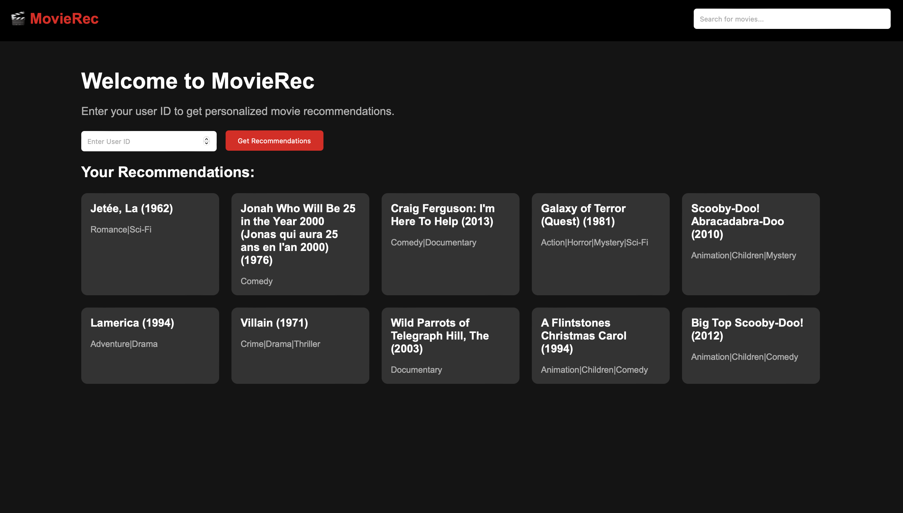
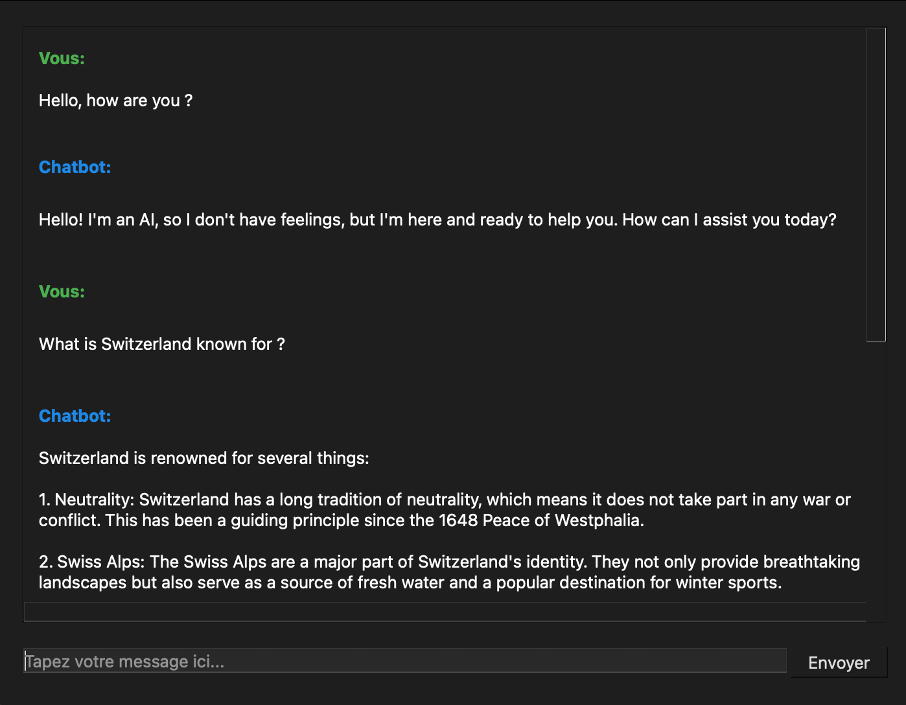
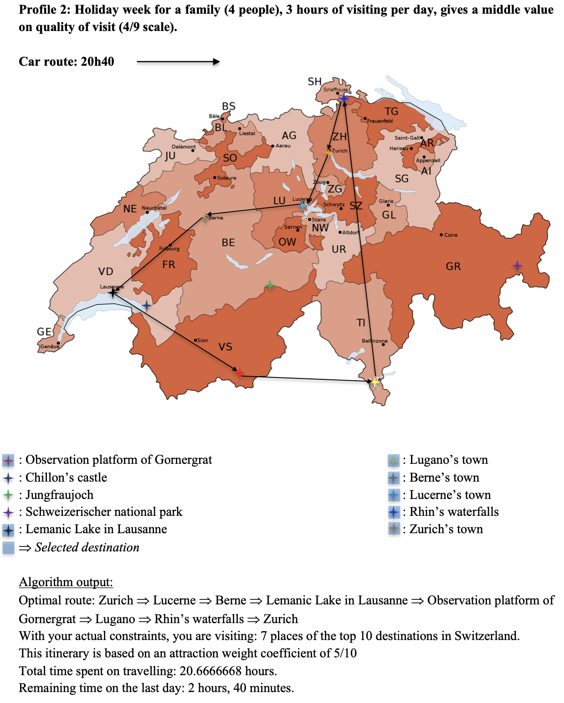
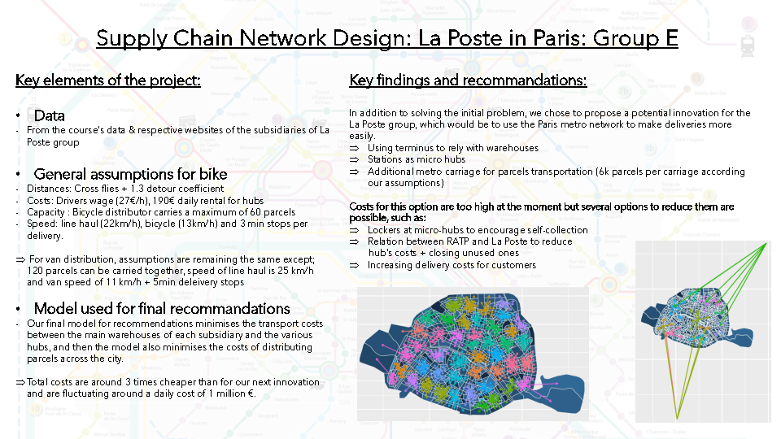
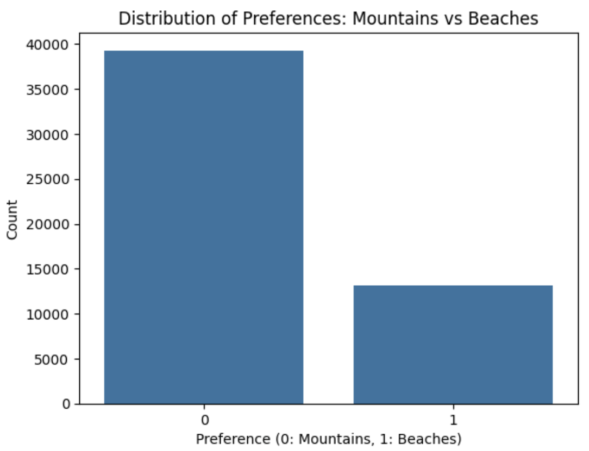

## **Selected Projects**

### [Movie Recommendation System with PyTorch & Flask](https://github.com/Adlan-Boithier/Movie-Recommendation)

- Interactive Interface: Built with Flask and modern CSS, inspired by streaming platforms like Netflix and Disney+.
- Model Training: Uses PyTorch for training a recommendation model.
- Exploratory Data Analysis (EDA): Analyzes user ratings and movie metadata to identify key trends.
- Deployment: Can be deployed locally or on platforms like Heroku.

### [Interactive chatbot application built with Mistral AI API & PyQt5](https://github.com/Adlan-Boithier/chatbot-project)

- Real-time conversation: Generates intelligent responses using the Mistral AI API.
- User-friendly interface: Designed with PyQt5 for smooth and intuitive interactions.
- Secure API management: Uses environment variables (dotenv) to keep API keys safe.
- Easy setup: Minimal dependencies and straightforward installation.

### [Optimizing Swiss Tourism: Cost-Effective Travel with Python Models](https://github.com/Adlan-Boithier/Sustainable-Logistics/)

- Developed Python algorithms, including the Traveling Salesman Problem (TSP) and a customized knapsack model, for tourism optimization.
- Created 7 scenarios focusing on affordability, environmental sustainability, and travel efficiency.
- Conducted sensitivity analysis to evaluate the impact of parameters like budget on route optimization, testing with 8 different budget levels.
- Addressed high travel costs by offering optimized, eco-friendly travel plans for accessible tourism in Switzerland.

### [Optimizing Parcel Delivery in Paris with R: Collaboration with La Poste](https://github.com/Adlan-Boithier/Supply-Chain-La-Poste/)

- Developed a data-driven solution with La Poste to optimize parcel delivery in Paris using R.
- Processed over 70,000 monthly delivery data points to identify cost-saving opportunities.
- Applied Vehicle Routing Problem (VRP) algorithms and R’s optimization libraries to design efficient delivery routes.
- Achieved a reduction in daily delivery costs to approximately 1,000,000€.
- Proposed a novel approach utilizing the Paris metro system for sustainable parcel distribution, leveraging recent infrastructure upgrades.

### [Travel Preferences: Mountains vs Beaches](https://github.com/Adlan-Boithier/Mountains-vs-Beaches) 

- Explored the long-standing debate of holiday preferences: beach vs. mountains, prompting an investigation into the predictability of preferences based on lifestyle and demographics.
- Developed visualizations to illustrate the distribution of preferences and key features related to holiday choices.
- Examined correlations between demographic and lifestyle factors and travel preferences.
- Built a predictive model using a Random Forest Classifier to analyze preference data.
- Achieved a 99% accuracy with the model, indicating that demographic and lifestyle factors can provide valuable insights into travel preferences.
